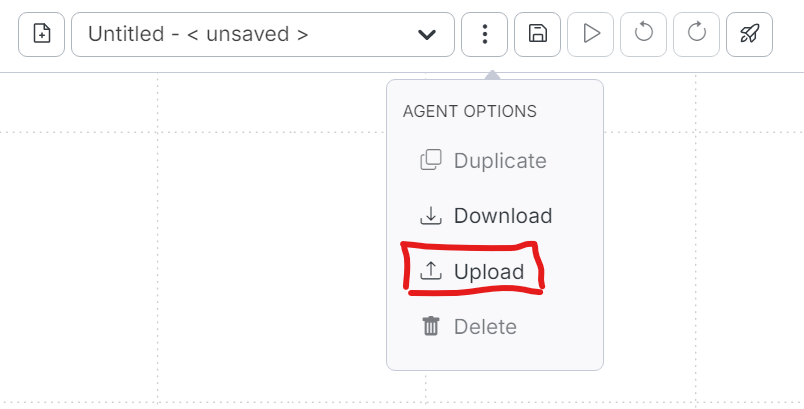

# example-agents
A public repository of example integrail.ai agents

## Repository URL
This repository is hosted on GitHub at:  
[https://github.com/michael-h-integrail/example-agents](https://github.com/michael-h-integrail/example-agents)

## How to Clone This Repository
If you're new to Git and want to download this repository to your local machine, follow these steps:

### **Option 1: Using Git (Recommended)**
1. **Install Git** (if you haven’t already):
    - [Download and install Git](https://git-scm.com/downloads) for your operating system.
2. **Open a Terminal or Command Prompt**
    - On Windows, you can use **Git Bash**, **Command Prompt**, or **PowerShell**.
    - On macOS or Linux, use the **Terminal**.
3. **Navigate to the folder where you want to clone the repository**
   ```sh
   cd /path/to/your/directory
   ```
   (Replace /path/to/your/directory with your desired location.) 
4. **Run the following command to clone the repository  
   ```sh
   git clone https://github.com/michael-h-integrail/example-agents.git
   ```
   Navigate into the cloned repository

   ```sh
   cd example-agents
   ``` 
You now have a local copy of the repository and can start exploring the files.

### **Option 2: Download as a ZIP (No Git Required)**
If you don’t want to use Git, you can download the repository as a ZIP file:

1. Go to the repository page:  
   [https://github.com/michael-h-integrail/example-agents](https://github.com/michael-h-integrail/example-agents)
2. Click the **Code** button (green dropdown).
3. Select **Download ZIP**.
4. Extract the ZIP file to a folder on your computer.

Now you have access to the files without needing Git.

## Using the Examples
The `simple-node-examples` folder contains some very simple examples by node type.  To use an example:
1. Login or Sign up for a FREE Integrail Studio account at [studio.integrail.ai](https://studio.integrail.ai/) 
2Once Logged In, Click 'Create New Agent'
2. Click "..." menu, next to the file dropdown in the top/middle section of the window.
3. Click the upload icon:  
      
4. Click **"Choose File"**
5. Browse to the example you wish to try in Integrail Studio and select it

You can run the examples in the Designer (recommended for a deeper understanding).

Or you can Click **"Chat with Agents"** on the left navigation bar and select the agent you want to chat with.  

This provides a simple chat interface with the example agent.  
Be sure to check out the Readme.md file in each folder for more information and detailed notes the agents in that folder
